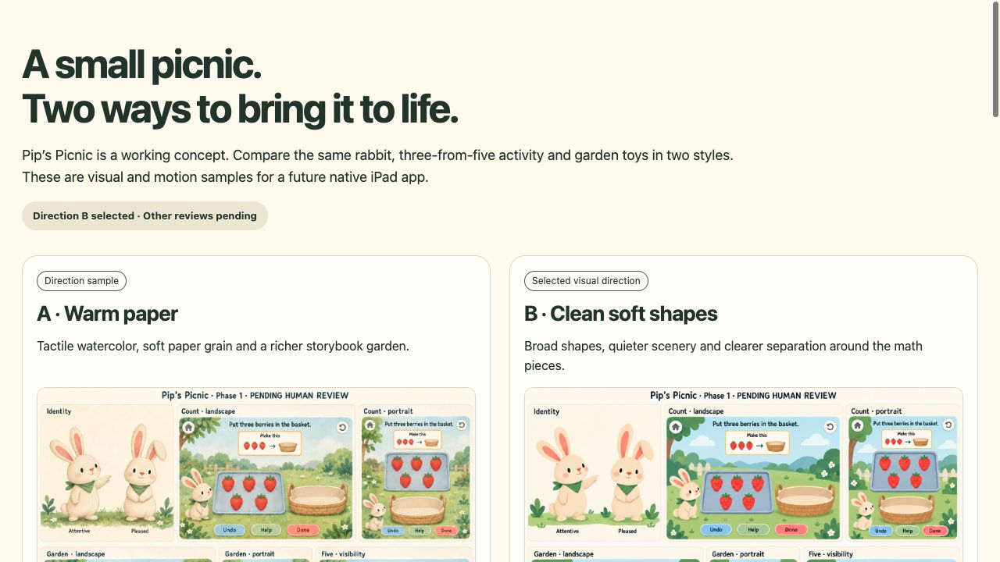

# Adult gallery — design hook triage

October 3, 2026. Scope: the four findings in the Phase 1 adult review gallery. The hook marked attribution unknown; these are not treated as new regressions or grounds to expand production scope.

| Finding | Decision | Evidence / change |
|---|---|---|
| Side-tab accent border | Fixed | Removed the note’s 5px left border. The tinted note retains its grouping with a uniform 16px radius. Browser confirms 0px left border. |
| All-caps body | Fixed | Status now uses sentence case. Header metadata moved to the footer; the uppercase kicker styling was removed. |
| Flat type hierarchy | Suppressed, file-scoped false positive | Detector reported body 16px, h3 19px and mobile h2 23px, omitting the responsive `clamp()` h1. Actual 1280×720 browser measurement: h1 51.2px, h2 27px, h3 19px, body 16px. The mobile CSS retains h1 ≥30px over h2 23px. |
| Cream palette | Suppressed, file-scoped intentional design | Preserve the gallery’s existing `--paper: #fffaf0` as a deliberate warm frame for the picnic illustration comparison. This is a reviewer decision about the adult gallery; it does not claim separate user approval of a final app palette. |

Standing findings: **none**. Both exceptions were added through the prescribed `hooks ignore-value` command in [shared detector configuration](../../.impeccable/config.json), scoped only to `assets/production/picnic-v1/review/index.html`. No entire rule or file was disabled.

The single post-edit mechanical detector pass reported only the two subsequently waived findings. Render confirmation showed the sentence-case status, no kicker, no left stripe, loaded 1536×1024 direction images and no horizontal overflow at 1280×720. [Screenshot](evidence/gallery-hook-review.jpg) records the gallery header and comparison. Existing art takes, motion, requests, app and experiments remain unchanged. No asset batch or native implementation was started.

